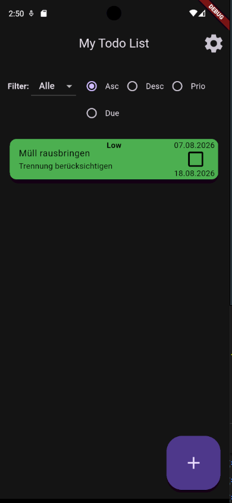
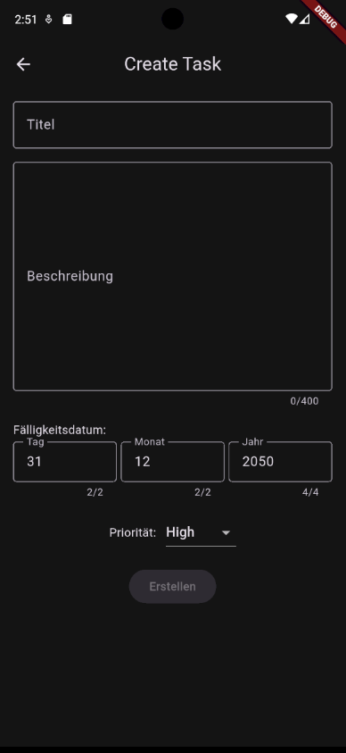
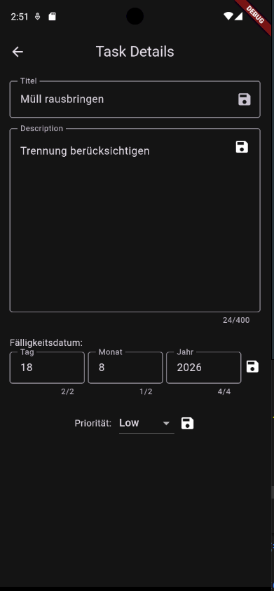
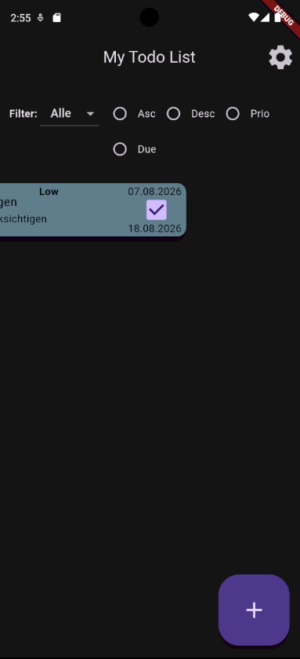

# Todo App

A Flutter task manager with priorities, due dates, filtering and sorting. All data is stored locally on the device, so the list survives closing and reopening the app — no account, no backend.

Built as a practice project while learning Flutter, with a focus on clean state management and a clear separation between UI, state and persistence.

## Features

**Tasks**

- Create tasks with title, description, due date and priority (Low / Medium / High)
- Form validation on every field — the create button stays disabled until the input is valid
- Edit title, description, due date and priority on a detail screen
- Mark tasks as done via checkbox
- Swipe to delete, with a confirmation dialog — deletion is only allowed once a task is marked as done

**Overview**

- Task cards are colour-coded by priority, and turn grey once completed
- Creation date and due date are shown directly on the card
- Filter by status: all / open / completed
- Sort by title (A–Z, Z–A), by priority, or by due date

**App**

- Light and dark theme, switchable in the settings and remembered across restarts
- Dates formatted in German locale (`dd.MM.yyyy`)

## Screenshots

    
## Architecture

State is managed with `provider`. Two `ChangeNotifier`s sit above the widget tree: `TaskList` holds the tasks, the active filter and all sorting logic, `ThemeNotifier` holds the theme mode. Widgets read from them via `Consumer` and `context.watch`, so the UI stays free of business logic.

Persistence is isolated in two service classes. Tasks are serialised to JSON and written to `SharedPreferences` as a string list; user settings are stored separately. Neither the views nor the models know how or where data is saved.

```
lib/
├── model/     Task, TaskList (state + sorting/filtering)
├── service/   TodoService, UserPreferencesService (persistence)
├── view/      Home, Create, Details, Settings screens
├── widget/    TaskCard, filter dropdown, sort controls
└── theme/     Theme definitions and ThemeNotifier
```

## Tech

Flutter · Dart · [provider](https://pub.dev/packages/provider) · [shared_preferences](https://pub.dev/packages/shared_preferences) · [intl](https://pub.dev/packages/intl) · [uuid](https://pub.dev/packages/uuid)

## Getting started

```bash
git clone https://github.com/KPfanne/flutter-todo-app.git
cd flutter-todo-app
flutter pub get
flutter run
```

Requires Dart SDK 3.12 or newer. No configuration or API keys needed.
